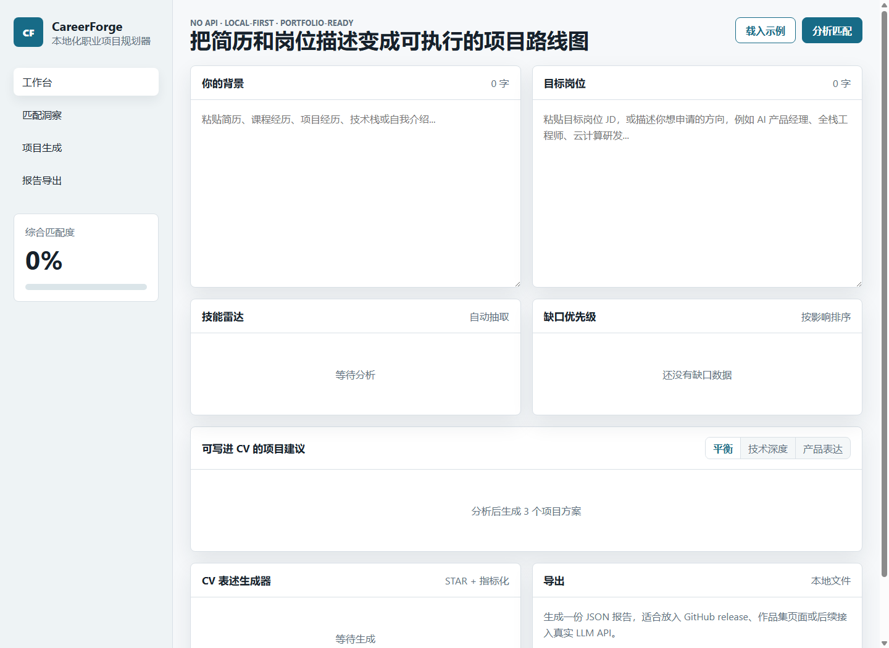

# CareerForge / 职业项目规划器

## Overview / 项目简介

CareerForge is a local-first web prototype for matching a CV against a target job description. It extracts skill signals from pasted text, highlights gaps, suggests portfolio project ideas, and drafts CV bullets that can be edited by the user.

CareerForge 是一个本地运行的职业项目规划器。用户粘贴自己的简历/经历和目标岗位 JD 后，页面会提取技能信号、计算匹配度、排序技能缺口，并给出项目建议和 CV bullet 草稿。

## Why I Built This / 项目背景

I built this as a personal portfolio helper while preparing for job applications. I wanted a small tool that could connect job descriptions with concrete project planning, instead of only giving generic career advice.

这个项目是我在准备求职材料时做的个人工具。目标是把岗位描述和具体项目规划联系起来，而不是只生成泛泛的建议。

## My Contributions / 我的工作

- Built the full frontend with HTML, CSS and vanilla JavaScript.
- Implemented local text analysis for CV and job description inputs.
- Designed a weighted skill-matching and gap-prioritisation workflow.
- Added project suggestion modes for balanced, technical-depth and product-focused plans.
- Added JSON report export for saving an analysis result.

- 使用 HTML、CSS 和原生 JavaScript 完成前端页面。
- 实现简历文本和岗位描述文本的本地分析。
- 设计技能匹配度和技能缺口优先级逻辑。
- 支持平衡、技术深度、产品表达三种项目生成模式。
- 支持导出 JSON 分析报告，方便后续整理。

## Tech Stack / 技术栈

- HTML
- CSS
- Vanilla JavaScript
- Browser local execution, no backend

## Features / 主要功能

- Paste CV / experience text and a target job description.
- View skill match score and skill radar.
- Rank gaps by job relevance.
- Generate portfolio project ideas based on the selected mode.
- Generate editable CV bullet drafts.
- Export the analysis as JSON.

## Results / 项目成果

The current version is an MVP that runs directly in the browser. It is useful for exploring how a target JD maps to portfolio project ideas, but the analysis is rule-based and depends on the built-in skill dictionary.

当前版本是一个浏览器内运行的 MVP，可以帮助把目标岗位需求转成项目规划思路。分析逻辑基于内置技能词典，因此适合做求职准备辅助，不适合作为正式招聘评估工具。

## How to Run / 如何运行

Open `index.html` in a browser.

直接用浏览器打开 `index.html` 即可运行。

## Screenshots / Results Preview

## Future Improvements / 后续改进

- Add PDF / Word CV parsing.
- Improve the skill dictionary and matching rules.
- Add an optional LLM mode for more natural project descriptions.
- Save multiple target roles and compare results.
- Generate a README draft or study plan from the selected project idea.

## What I Learned / 我的收获

This project helped me turn job descriptions into more concrete project requirements. It also made me think about how much of a career tool can be useful before adding a backend or an LLM.

这个项目让我练习了把 JD 中的技能要求转成可执行项目计划，也让我意识到本地规则系统已经能完成一部分求职准备工作，后续再接入 LLM 会更有方向。
